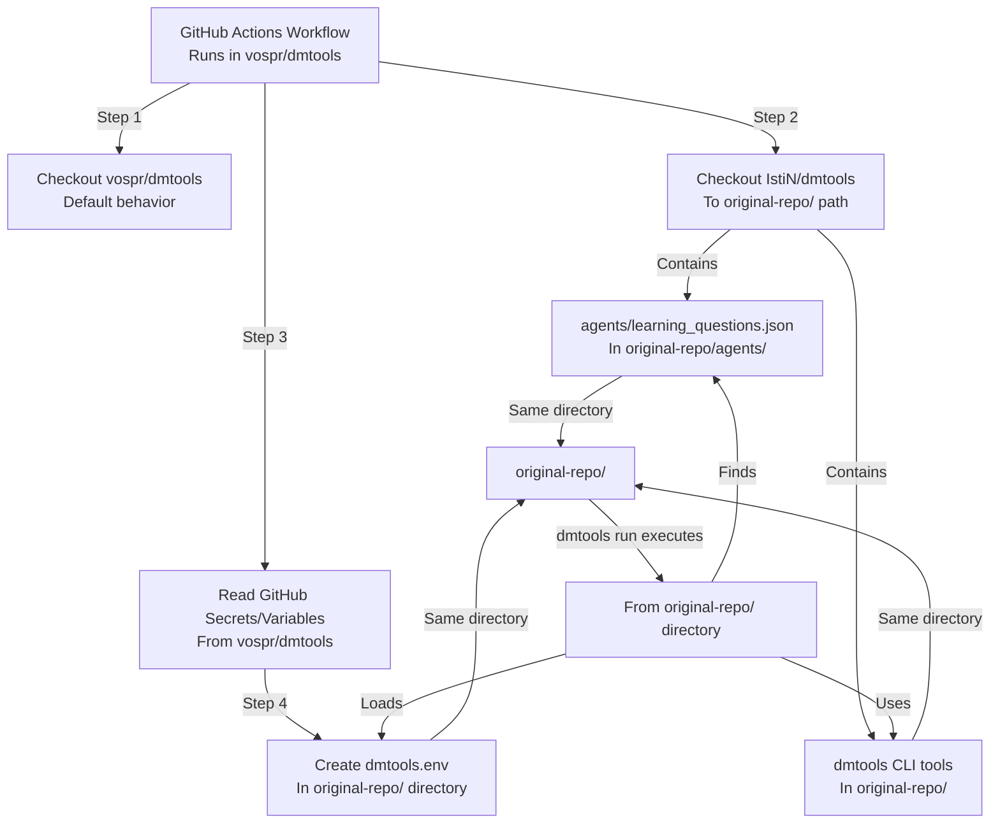

# How Using Original Repo Tools with Your Credentials Works

**Date:** January 3, 2026  
**Purpose:** Explain the architecture and flow of using `IstiN/dmtools` tools with your own credentials stored in GitHub Secrets/Variables.

---

## Overview

When you run the workflow in `vospr/dmtools`, you want to:
- ✅ Use the **latest tools** from `IstiN/dmtools` (constantly updated)
- ✅ Use **agent configs** from `IstiN/dmtools` (like `agents/learning_questions.json`)
- ✅ Use **your own credentials** (stored in GitHub Secrets/Variables in `vospr/dmtools`)

This requires a specific workflow structure that checks out the original repo and injects your credentials.

---

## Architecture Flow



---

## Root Cause 1: Missing Checkout of IstiN/dmtools

### The Problem

**Current workflow (broken):**
```
Workflow runs in: vospr/dmtools
├── .github/workflows/ai-teammate.yml  ✅ (workflow file exists)
├── agents/
│   └── learning_questions.json  ❌ (doesn't exist here)
└── dmtools.env  ❌ (not created)
```

**What happens:**
1. Workflow starts in `vospr/dmtools` directory
2. Tries to find `agents/learning_questions.json`
3. **File doesn't exist** in `vospr/dmtools/agents/`
4. Error: `Configuration file not found: agents/learning_questions.json`

### The Solution

**Required workflow (fixed):**
```
Workflow runs in: vospr/dmtools
├── .github/workflows/ai-teammate.yml  ✅
└── (workflow checks out IstiN/dmtools to original-repo/)

original-repo/  (checked out from IstiN/dmtools)
├── agents/
│   └── learning_questions.json  ✅ (exists here)
├── dmtools.sh  ✅
├── install.sh  ✅
└── dmtools.env  ✅ (created by workflow from your secrets)
```

**How it works:**
1. Workflow starts in `vospr/dmtools` directory
2. **Step 1:** Checks out `IstiN/dmtools` to `original-repo/` path
   ```yaml
   - name: Checkout Original Repository
     uses: actions/checkout@v4
     with:
       repository: IstiN/dmtools
       ref: main
       path: original-repo  # Creates original-repo/ directory
   ```
3. Now `agents/learning_questions.json` exists at: `original-repo/agents/learning_questions.json`
4. Workflow can find the agent config file

### Why This Is Needed

- **Agent configs are in `IstiN/dmtools`:** The file `agents/learning_questions.json` exists in the original repository, not in your fork
- **Tools are in `IstiN/dmtools`:** The `dmtools` CLI and related tools are in the original repository
- **Always up-to-date:** By checking out `IstiN/dmtools`, you get the latest version automatically
- **No manual sync needed:** You don't need to manually copy files or sync your fork

---

## Root Cause 2: Missing Correct Working Directory

### The Problem

**Current workflow (broken):**
```yaml
- name: Run AI Teammate
  # No working-directory specified
  run: |
    dmtools run "agents/learning_questions.json"
```

**What happens:**
1. Workflow runs `dmtools run` from `vospr/dmtools` directory (default)
2. Looks for `agents/learning_questions.json` in `vospr/dmtools/agents/`
3. **File doesn't exist** there (it's in `original-repo/agents/`)
4. Looks for `dmtools.env` in `vospr/dmtools/`
5. **File doesn't exist** there (it's created in `original-repo/`)
6. Error: `Configuration file not found`

### The Solution

**Required workflow (fixed):**
```yaml
- name: Create dmtools.env from Your Secrets
  working-directory: original-repo  # Create file here
  run: |
    cat > dmtools.env << EOF
    JIRA_EMAIL=${{ secrets.JIRA_EMAIL }}
    # ... etc
    EOF

- name: Run AI Teammate
  working-directory: original-repo  # Run from here
  run: |
    dmtools run "agents/learning_questions.json"
```

**How it works:**
1. **Step 1:** Create `dmtools.env` in `original-repo/` directory
   - File location: `/home/runner/work/.../original-repo/dmtools.env`
   - Contains your credentials from GitHub Secrets/Variables

2. **Step 2:** Run `dmtools run` from `original-repo/` directory
   - Working directory: `/home/runner/work/.../original-repo/`
   - Looks for `agents/learning_questions.json` in current directory: `original-repo/agents/learning_questions.json` ✅
   - Looks for `dmtools.env` in current directory: `original-repo/dmtools.env` ✅
   - Both files found! ✅

### Why This Is Needed

**`dmtools.sh` looks for files in specific locations:**

1. **Agent config file:** `dmtools run "agents/learning_questions.json"`
   - Looks for file relative to **current working directory**
   - If working directory is `vospr/dmtools`, looks in `vospr/dmtools/agents/` ❌
   - If working directory is `original-repo/`, looks in `original-repo/agents/` ✅

2. **dmtools.env file:** Automatically loaded by `dmtools.sh`
   - Priority 1: Current working directory: `./dmtools.env`
   - Priority 2: Script directory: `$SCRIPT_DIR/dmtools.env`
   - If working directory is `vospr/dmtools`, looks for `vospr/dmtools/dmtools.env` ❌
   - If working directory is `original-repo/`, looks for `original-repo/dmtools.env` ✅

**Both files must be in the same directory:**
- Agent config: `original-repo/agents/learning_questions.json`
- Credentials: `original-repo/dmtools.env`
- Working directory: `original-repo/`

---

## Complete Flow Example

### Step-by-Step Execution

**1. Workflow starts in `vospr/dmtools`:**
```
/home/runner/work/dmtools/dmtools/
├── .github/workflows/ai-teammate.yml
└── (other vospr/dmtools files)
```

**2. Checkout `IstiN/dmtools` to `original-repo/`:**
```
/home/runner/work/dmtools/dmtools/
├── .github/workflows/ai-teammate.yml
└── original-repo/  ← NEW: Checked out from IstiN/dmtools
    ├── agents/
    │   └── learning_questions.json  ✅ (from IstiN/dmtools)
    ├── dmtools.sh
    ├── install.sh
    └── (all files from IstiN/dmtools)
```

**3. Create `dmtools.env` in `original-repo/`:**
```
/home/runner/work/dmtools/dmtools/original-repo/
├── agents/
│   └── learning_questions.json
├── dmtools.env  ← NEW: Created from your GitHub Secrets
└── (other files)
```

**4. Run `dmtools run` from `original-repo/`:**
```bash
cd /home/runner/work/dmtools/dmtools/original-repo/
dmtools run "agents/learning_questions.json"
```

**What `dmtools` does:**
1. Looks for config file: `./agents/learning_questions.json` ✅ (found in current directory)
2. Looks for `dmtools.env`: `./dmtools.env` ✅ (found in current directory)
3. Loads credentials from `dmtools.env`
4. Executes the agent config
5. Success! ✅

---

## Why Both Root Causes Must Be Fixed Together

### Root Cause 1 Alone (Checkout IstiN/dmtools) - Still Broken

**If you only checkout `IstiN/dmtools` but don't set working directory:**
```yaml
- name: Checkout Original Repository
  uses: actions/checkout@v4
  with:
    repository: IstiN/dmtools
    path: original-repo  ✅ (file exists here)

- name: Run AI Teammate
  # No working-directory - runs from vospr/dmtools
  run: |
    dmtools run "agents/learning_questions.json"  ❌ (looks in wrong place)
```

**Result:**
- File exists at: `original-repo/agents/learning_questions.json` ✅
- But `dmtools run` looks in: `vospr/dmtools/agents/learning_questions.json` ❌
- Error: `Configuration file not found`

### Root Cause 2 Alone (Set working directory) - Still Broken

**If you only set working directory but don't checkout `IstiN/dmtools`:**
```yaml
- name: Run AI Teammate
  working-directory: original-repo  ✅ (correct directory)
  run: |
    dmtools run "agents/learning_questions.json"  ❌ (file doesn't exist)
```

**Result:**
- Working directory is correct: `original-repo/` ✅
- But `original-repo/` directory doesn't exist (not checked out) ❌
- Error: `Configuration file not found`

### Both Root Causes Fixed - Works! ✅

**Checkout `IstiN/dmtools` AND set working directory:**
```yaml
- name: Checkout Original Repository
  uses: actions/checkout@v4
  with:
    repository: IstiN/dmtools
    path: original-repo  ✅ (creates directory with files)

- name: Create dmtools.env from Your Secrets
  working-directory: original-repo  ✅ (creates file in correct location)
  run: |
    cat > dmtools.env << EOF
    # ... your credentials
    EOF

- name: Run AI Teammate
  working-directory: original-repo  ✅ (runs from correct location)
  run: |
    dmtools run "agents/learning_questions.json"  ✅ (finds file)
```

**Result:**
- File exists at: `original-repo/agents/learning_questions.json` ✅
- `dmtools.env` exists at: `original-repo/dmtools.env` ✅
- `dmtools run` looks in: `original-repo/agents/learning_questions.json` ✅
- Success! ✅

---

## File Location Summary

### Without Fixes (Broken)

| File | Expected Location | Actual Location | Status |
|------|------------------|-----------------|--------|
| `agents/learning_questions.json` | `vospr/dmtools/agents/` | ❌ Doesn't exist | Missing |
| `dmtools.env` | `vospr/dmtools/` | ❌ Not created | Missing |
| Working directory | `vospr/dmtools/` | `vospr/dmtools/` | Wrong |

### With Fixes (Working)

| File | Expected Location | Actual Location | Status |
|------|------------------|-----------------|--------|
| `agents/learning_questions.json` | `original-repo/agents/` | `original-repo/agents/` ✅ | Found |
| `dmtools.env` | `original-repo/` | `original-repo/` ✅ | Created |
| Working directory | `original-repo/` | `original-repo/` ✅ | Correct |

---

## Key Takeaways

1. **Checkout `IstiN/dmtools`** to get:
   - Agent config files (`agents/learning_questions.json`)
   - Latest tools and scripts
   - Always up-to-date code

2. **Create `dmtools.env`** in the same directory where:
   - Agent configs exist
   - `dmtools run` will execute

3. **Set working directory** to `original-repo/` so:
   - `dmtools run` finds the agent config file
   - `dmtools.sh` finds the `dmtools.env` file
   - Everything is in the same location

4. **Both fixes are required:**
   - Without checkout: Files don't exist
   - Without working directory: Files exist but can't be found
   - With both: Everything works! ✅

---

## Visual Comparison

### Broken Workflow Structure

```
vospr/dmtools (workflow runs here)
├── .github/workflows/ai-teammate.yml
├── agents/  ❌ (empty or doesn't exist)
└── dmtools.env  ❌ (not created)

dmtools run executes from: vospr/dmtools/
Looks for: vospr/dmtools/agents/learning_questions.json  ❌ NOT FOUND
Looks for: vospr/dmtools/dmtools.env  ❌ NOT FOUND
```

### Fixed Workflow Structure

```
vospr/dmtools (workflow runs here)
├── .github/workflows/ai-teammate.yml
└── (workflow checks out IstiN/dmtools)

original-repo/ (checked out from IstiN/dmtools)
├── agents/
│   └── learning_questions.json  ✅ (from IstiN/dmtools)
├── dmtools.env  ✅ (created from your secrets)
└── (all tools from IstiN/dmtools)

dmtools run executes from: original-repo/
Looks for: original-repo/agents/learning_questions.json  ✅ FOUND
Looks for: original-repo/dmtools.env  ✅ FOUND
```

---

## How Your Credentials Are Used

### Step 1: Credentials Stored Securely

**Location:** `vospr/dmtools` repository
- **GitHub Secrets:** `JIRA_EMAIL`, `JIRA_API_TOKEN`, `GEMINI_API_KEY`, etc.
- **GitHub Variables:** `JIRA_BASE_PATH`, `JIRA_AUTH_TYPE`, etc.
- **Security:** Encrypted, only accessible to workflows in `vospr/dmtools`

### Step 2: Credentials Injected at Runtime

**During workflow execution:**
1. Workflow reads secrets/variables from `vospr/dmtools`
2. Creates `dmtools.env` file in `original-repo/` directory
3. File contains your credentials (masked in logs)

### Step 3: Tools Use Your Credentials

**When `dmtools run` executes:**
1. Runs from `original-repo/` directory
2. `dmtools.sh` automatically loads `original-repo/dmtools.env`
3. Your credentials are available to all dmtools commands
4. Tools from `IstiN/dmtools` use your credentials

### Result

- ✅ **Tools:** Latest from `IstiN/dmtools` (always up-to-date)
- ✅ **Agent configs:** From `IstiN/dmtools` (always up-to-date)
- ✅ **Credentials:** Your own from GitHub Secrets/Variables (secure)
- ✅ **No manual sync:** Automatic updates from original repo
- ✅ **No credential exposure:** Never committed to repository

---

## Summary

**Root Cause 1 (Checkout IstiN/dmtools):**
- **Why:** Agent configs and tools are in `IstiN/dmtools`, not in your fork
- **What:** Checkout `IstiN/dmtools` to `original-repo/` path
- **Result:** Files are available in `original-repo/` directory

**Root Cause 2 (Correct working directory):**
- **Why:** `dmtools run` looks for files relative to current working directory
- **What:** Set `working-directory: original-repo` for all steps that need files
- **Result:** `dmtools run` finds both config file and `dmtools.env` in same directory

**Together:**
- Files exist in `original-repo/` (from checkout)
- `dmtools run` executes from `original-repo/` (from working-directory)
- Both files found in same location
- Success! ✅

---

**Last Updated:** January 3, 2026
