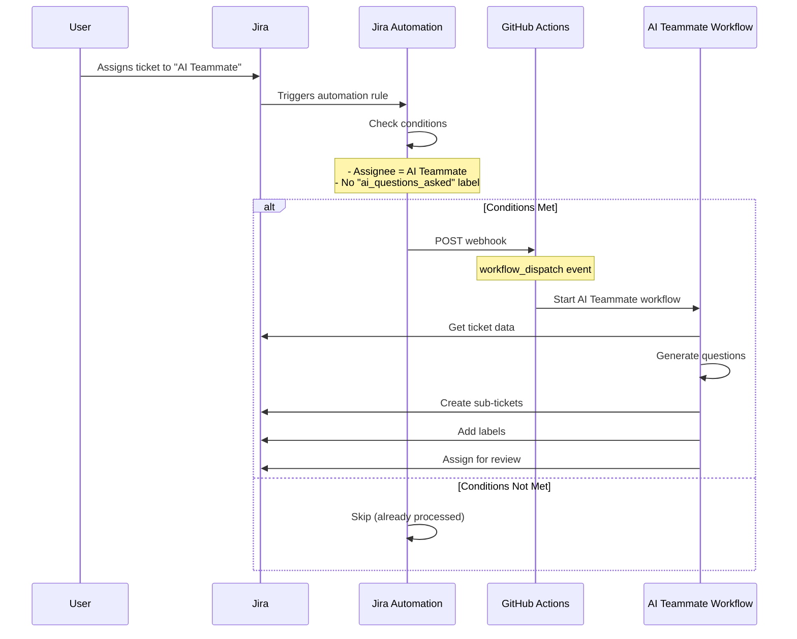

# Jira Automation Setup Guide

This guide will help you create Jira automation rules that automatically trigger your AI teammate GitHub Actions workflow when tickets are assigned.

## Overview

**What We'll Create:**
- ✅ Jira automation rule triggered by ticket assignment
- ✅ Webhook to GitHub Actions workflow
- ✅ Conditional logic to prevent duplicate processing
- ✅ Error handling and logging

**Time Required:** 15-20 minutes

---

## Automation Flow



---

## Prerequisites

Before setting up Jira automation, ensure:

- [ ] GitHub Actions workflow is working (manual trigger tested)
- [ ] GitHub Personal Access Token created
- [ ] Jira has Automation feature enabled (available in most plans)
- [ ] You have Jira admin or project admin permissions

---

## Step 1: Create GitHub Personal Access Token (If Not Already Done)

This token allows Jira to trigger GitHub Actions workflows.

### Generate Token

1. **Go to GitHub Settings**
   - Open: [https://github.com/settings/tokens](https://github.com/settings/tokens)

2. **Generate New Token**
   - Click **"Generate new token"** → **"Generate new token (classic)"**
   - **Note:** `Jira Automation Webhook`
   - **Expiration:** 90 days (for learning), or No expiration (for production)

3. **Select Scopes:**
   - ✅ `repo` - Full control of private repositories
   - ✅ `workflow` - Update GitHub Action workflows

4. **Generate and Copy**
   - Click **"Generate token"**
   - **CRITICAL:** Copy the token immediately (format: `ghp_...`)

### Test Token

```bash
# Test that token can access your repository
curl -H "Authorization: token ghp_YOUR_TOKEN" \
  https://api.github.com/repos/YOUR_ORG/dmtools-ai-teammate

# Expected: JSON with repository information
```

---

## Step 2: Navigate to Jira Automation

### Access Automation Rules

1. **Go to Your Jira Project**
   - Open: `https://yourcompany.atlassian.net/jira/software/projects/ATL`

2. **Open Automation Settings**
   - Click **Project settings** (bottom left)
   - OR go to top navigation: **Project** → **Project settings**
   
3. **Access Automation**
   - In left sidebar, click **"Automation"**
   - OR navigate directly: `https://yourcompany.atlassian.net/jira/settings/projects/ATL/automation`

4. **Create New Rule**
   - Click **"Create rule"** button

---

## Step 3: Configure Automation Rule

### Rule Name and Description

**Name:** `AI Teammate - Generate Clarifying Questions`

**Description:**
```
Automatically triggers AI teammate to analyze tickets and generate clarifying questions when:
1. Ticket is assigned to "AI Teammate Bot" user
2. Ticket doesn't already have "ai_questions_asked" label

Calls GitHub Actions workflow to:
- Analyze ticket description
- Generate 2-5 clarifying questions
- Create sub-tickets for each question
- Add label to prevent reprocessing
```

---

### Step 3.1: Configure Trigger

**Trigger:** Issue assigned

**Configuration:**
- **Events:** `Issue assigned`
- **Issues:** All issues (or filter by issue type: Story, Task, etc.)

Click **"Save"**

---

### Step 3.2: Add Condition - Check Assignee

Add a condition to only process when assigned to AI Teammate.

**1. Click "+ New condition"**

**2. Choose:** `Advanced compare condition`

**3. Configure:**
- **First value:** `{{issue.assignee.displayName}}`
- **Condition:** `equals`
- **Second value:** `AI Teammate Bot` (or your AI teammate user name)

**Alternative (using account ID):**
- **First value:** `{{issue.assignee.accountId}}`
- **Condition:** `equals`
- **Second value:** `712020:...` (your AI teammate's account ID)

Click **"Save"**

---

### Step 3.3: Add Condition - Check Label

Add a condition to skip if already processed.

**1. Click "+ New condition"**

**2. Choose:** `Advanced compare condition`

**3. Configure:**
- **First value:** `{{issue.labels}}`
- **Condition:** `does not contain`
- **Second value:** `ai_questions_asked`

**Alternative approach (more precise):**

Use **"Issue fields condition"**:
- **Field:** Labels
- **Condition:** Does not include any of
- **Value:** `ai_questions_asked`

Click **"Save"**

---

### Step 3.4: Create Variable for GitHub Token

Create a variable to store the GitHub PAT securely within the rule.

**1. Click "+ New action"**

**2. Choose:** `Create variable`

**3. Configure:**
- **Variable name:** `githubToken`
- **Smart value:** Paste your GitHub PAT token here
  - Format: `ghp_...`
  - **IMPORTANT:** Store token securely

**Alternative (more secure):**
- Some Jira plans support "Project variables" or "Global variables"
- Check if your plan allows storing sensitive data securely

Click **"Save"**

---

### Step 3.5: Send Webhook to GitHub Actions

This is the main action that triggers the workflow.

**1. Click "+ New action"**

**2. Choose:** `Send web request`

**3. Configure:**

**HTTP Method:** `POST`

**Webhook URL:**
```
https://api.github.com/repos/YOUR_ORG/dmtools-ai-teammate/actions/workflows/learning-ai-teammate.yml/dispatches
```

**Replace:**
- `YOUR_ORG` with your GitHub username or organization
- `dmtools-ai-teammate` with your repository name

**Headers:**
```
Accept: application/vnd.github.v3+json
Authorization: token {{githubToken}}
Content-Type: application/json
```

**Request Body (JSON):**
```json
{
  "ref": "main",
  "inputs": {
    "ticket_key": "{{issue.key}}",
    "config_file": "c:/Users/AndreyPopov/Documents/EPAM/AWS/GenAI Architect/ai-teammate/agents/learning_questions.json"
  }
}
```

**Web request body type:** `Custom data`

**Delay execution:** 0 seconds (optional: add 5-10 second delay to allow Jira to fully process assignment)

Click **"Save"**

---

### Step 3.6: Add Comment (Optional, for Tracking)

Add a comment to the ticket confirming AI processing started.

**1. Click "+ New action"**

**2. Choose:** `Add comment`

**3. Configure:**
- **Comment:**
```
🤖 AI Teammate processing started...

The AI is analyzing this ticket to generate clarifying questions. You'll be notified when complete.

Triggered by: {{initiator.displayName}}
GitHub Actions Run: Check [workflow runs](https://github.com/YOUR_ORG/dmtools-ai-teammate/actions)
```

Click **"Save"**

---

### Step 3.7: Error Handling (Optional, Advanced)

Add a catch-all for webhook failures.

**1. Click "+ New condition" after webhook**

**2. Choose:** `Advanced compare condition`

**3. Configure:**
- **First value:** `{{webhookResponse.status}}`
- **Condition:** `equals`
- **Second value:** `201`

**4. Add "Then" action:** Log success
**5. Add "Else" action:** Log error and notify

---

## Step 4: Review and Activate Rule

### Review Rule Configuration

Your rule should look like this:

```
Rule: AI Teammate - Generate Clarifying Questions

WHEN: Issue assigned

IF:
  ✅ issue.assignee.displayName equals "AI Teammate Bot"
  AND
  ✅ issue.labels does not contain "ai_questions_asked"

THEN:
  1. Create variable: githubToken = ghp_...
  2. Send web request: POST to GitHub Actions
  3. Add comment: "AI Teammate processing started..."

```

### Test Rule (Dry Run)

Jira automation allows testing without actually executing actions.

**1. Click "Turn on rule"** (toggle switch)

**2. Click actions menu (⋮)** → **"View audit log"**

---

## Step 5: Test End-to-End

### Test Scenario

1. **Open a Test Ticket**
   - Go to `https://yourcompany.atlassian.net/browse/ATL-2`

2. **Assign to AI Teammate**
   - Click **"Assign"** field
   - Select **"AI Teammate Bot"** (or your AI teammate user)
   - Click **"Save"**

3. **Watch Automation**
   - Within seconds, you should see:
     - Comment added: "AI Teammate processing started..."
   
4. **Check GitHub Actions**
   - Go to: `https://github.com/YOUR_ORG/dmtools-ai-teammate/actions`
   - You should see a new workflow run starting

5. **Wait for Completion** (1-3 minutes)
   - Workflow completes
   - Sub-tickets appear in Jira
   - Label `ai_questions_asked` added

6. **Verify in Jira**
   - Reload ATL-2
   - Check sub-tasks section
   - Verify label is present

---

## Step 6: Monitoring and Debugging

### View Automation Audit Log

1. **Go to Automation Settings**
   - Project settings → Automation
   - Click on your rule
   - Click **"Audit log"** tab

2. **Check Execution History**
   - See all times rule was triggered
   - View successful/failed executions
   - See webhook responses

### Example Audit Log Entry

```
✅ Rule executed successfully
   Trigger: Issue ATL-2 was assigned to AI Teammate Bot
   Conditions: All met
   Actions:
     ✅ Variable created: githubToken
     ✅ Web request sent (Status: 201)
     ✅ Comment added
   Duration: 1.2 seconds
```

### Debugging Failed Executions

If webhook fails:

**Check webhook response:**
```json
{
  "status": 422,
  "body": {
    "message": "Workflow not found",
    "errors": [...]
  }
}
```

**Common errors:**
- `404`: Workflow file not found (check filename)
- `422`: Invalid input parameters
- `401`: Authentication failed (check GitHub token)
- `403`: Token lacks necessary permissions

---

## Advanced Configuration

### Scenario: Process Different Ticket Types Differently

Create separate rules for:
- **Stories:** Generate functional questions
- **Bugs:** Generate reproduction questions
- **Tasks:** Generate technical approach questions

**Add condition:**
```
issue.issueType.name equals "Story"
```

**Use different config files:**
```json
{
  "ref": "main",
  "inputs": {
    "ticket_key": "{{issue.key}}",
    "config_file": "agents/story_questions.json"  // For stories
  }
}
```

### Scenario: Rate Limiting

Prevent overwhelming the AI API by adding delays:

**Add action between webhook calls:**
- **Action:** `Wait for a period of time`
- **Duration:** 30 seconds

### Scenario: Notify Team

Send Slack/Email notification when AI processing completes:

**Add webhook to Slack:**
```json
{
  "text": "AI Teammate processed {{issue.key}}: {{issue.summary}}",
  "attachments": [{
    "title": "View Ticket",
    "title_link": "{{issue.url}}"
  }]
}
```

---

## Troubleshooting

### Issue: Automation Rule Not Triggering

**Check:**
1. Rule is turned ON (toggle switch)
2. Assignee name matches exactly
3. Label condition is correct
4. View audit log for error messages

### Issue: Webhook Returns 404

**Cause:** Workflow file path incorrect

**Solution:**
```
# Correct format:
https://api.github.com/repos/USER/REPO/actions/workflows/FILENAME.yml/dispatches

# Example:
https://api.github.com/repos/john/dmtools-ai-teammate/actions/workflows/learning-ai-teammate.yml/dispatches
```

### Issue: Webhook Returns 401 (Unauthorized)

**Cause:** GitHub token invalid or missing

**Debug:**
```bash
# Test token manually
curl -H "Authorization: token ghp_YOUR_TOKEN" \
  https://api.github.com/repos/YOUR_ORG/YOUR_REPO
```

**Solution:**
- Regenerate GitHub PAT with correct scopes
- Update `githubToken` variable in automation rule

### Issue: Webhook Returns 422 (Unprocessable Entity)

**Cause:** Invalid input parameters

**Check:**
- Input names match workflow definition exactly
- `ticket_key` is valid
- `config_file` path is correct

### Issue: Rule Runs Multiple Times

**Cause:** Re-assigning ticket triggers rule again

**Solution:** Add label immediately in the automation rule before webhook:

**Add action (before webhook):**
- **Action:** `Edit issue fields`
- **Fields:** Labels
- **Operation:** Add
- **Value:** `ai_processing`

Then update condition to check for both labels:
```
issue.labels does not contain "ai_questions_asked"
AND
issue.labels does not contain "ai_processing"
```

---

## Security Best Practices

### Secure Token Storage

**❌ Don't:**
- Hardcode tokens in webhook body
- Share tokens in Jira comments
- Store tokens in ticket descriptions

**✅ Do:**
- Use Jira automation variables
- Rotate tokens regularly (every 90 days)
- Use minimal token permissions
- Monitor token usage via GitHub

### Audit Trail

Enable audit logging:
1. Check automation audit log weekly
2. Review triggered rules
3. Verify no unauthorized triggers
4. Monitor webhook response codes

---

## Success Criteria

Your Jira automation is successful if:

- [ ] ✅ Rule exists and is enabled
- [ ] ✅ Conditions are configured correctly
- [ ] ✅ Webhook URL is correct
- [ ] ✅ GitHub token works
- [ ] ✅ Test execution triggers workflow
- [ ] ✅ Workflow completes successfully
- [ ] ✅ Sub-tickets are created
- [ ] ✅ Labels prevent re-processing
- [ ] ✅ Audit log shows successful executions

---

## What's Next?

Once Jira automation is working:

1. ✅ **Auto-trigger from Jira assignment**
2. ✅ **GitHub Actions executes automatically**
3. ✅ **AI processes tickets**
4. ✅ **Results appear in Jira**

**→ Proceed to:** [08-troubleshooting-guide.md](08-troubleshooting-guide.md)

Learn how to debug common issues and optimize your setup.

---

**Document Version:** 1.0  
**Last Updated:** December 30, 2025  
**Previous Step:** [06-github-actions-setup.md](06-github-actions-setup.md)  
**Next Step:** [08-troubleshooting-guide.md](08-troubleshooting-guide.md)

