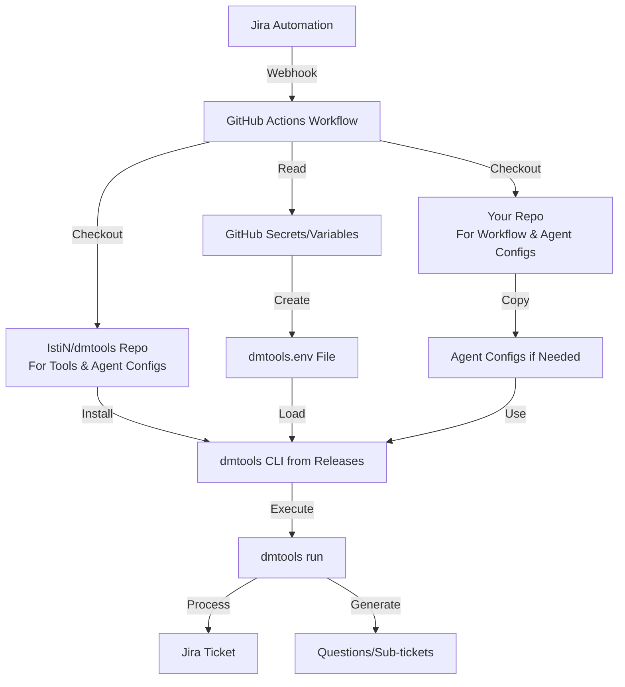

# Step-by-Step Implementation Guide: Using Original IstiN/dmtools with Your Credentials

**Date:** January 2, 2026  
**Goal:** Implement a solution to use the constantly updated `IstiN/dmtools` repository's tools and agent configs while maintaining your own credentials in GitHub Secrets/Variables.

**Important Constraint:** Workflows and actions cannot reference `IstiN/dmtools` directly (different owner). Use your fork `vospr/dmtools` or create a clean repository.

**Your Setup:**
- **Workflow Repository:** `vospr/dmtools` (where your workflow `ai-teammate.yml` exists)
- **Secrets/Variables Location:** `vospr/dmtools` (Settings → Secrets and variables → Actions)
- **Workflow File:** `.github/workflows/ai-teammate.yml` in `vospr/dmtools`
- **Original Repo:** `IstiN/dmtools` (checked out during workflow for tools and agent configs)

---

## Table of Contents

1. [Architecture Overview](#architecture-overview)
2. [Repository Strategy Decision](#repository-strategy-decision)
3. [Phase 1: Preparation](#phase-1-preparation)
4. [Phase 2: GitHub Secrets and Variables Setup](#phase-2-github-secrets-and-variables-setup)
5. [Phase 3: Workflow Implementation](#phase-3-workflow-implementation)
6. [Phase 4: Testing](#phase-4-testing)
7. [Phase 5: Jira Automation Integration](#phase-5-jira-automation-integration)
8. [Troubleshooting](#troubleshooting)

---

## Architecture Overview



**Key Points:**
- Workflow runs in **your repository** (`vospr/dmtools`)
- Tools and agent configs come from **original repository** (`IstiN/dmtools`)
- Credentials come from **GitHub Secrets/Variables** (your repository: `vospr/dmtools`)
- `dmtools.env` is created dynamically from secrets/variables

---

## Repository Strategy Decision

### Option A: Use Your Fork (vospr/dmtools) - Recommended

**Pros:**
- ✅ Already exists: `https://github.com/vospr/dmtools`
- ✅ Can sync updates from original when needed
- ✅ Can customize if needed
- ✅ Full control

**Cons:**
- ⚠️ Need to sync updates manually or via automation
- ⚠️ May diverge from original over time

**When to use:** If you want to maintain your own fork with occasional updates from original.

### Option B: Create Clean Repository

**Pros:**
- ✅ Minimal - only what you need
- ✅ No sync conflicts
- ✅ Easy to understand

**Cons:**
- ⚠️ Need to manually copy files from original
- ⚠️ Need to update manually when original changes

**When to use:** If you want a minimal setup with only specific files.

### Recommendation: Option A (Use vospr/dmtools)

Use your existing fork and sync updates from `IstiN/dmtools` when needed. This guide assumes Option A, but can be adapted for Option B.

---

## Phase 1: Preparation

### Step 1.1: Review Your Current dmtools.env

**Location:** `C:\Users\AndreyPopov\dmtools\dmtools.env` (or your local path)

**Action:**
1. Open your local `dmtools.env` file
2. Create a list of all variables that need to be migrated
3. Categorize them:

**Secrets (Sensitive - Store in GitHub Secrets):**
- `JIRA_EMAIL` - Your Jira email address
- `JIRA_API_TOKEN` - Your Jira API token
- `GEMINI_API_KEY` - Your Google Gemini API key
- `PAT_TOKEN` - Your GitHub Personal Access Token
- `CURSOR_API_KEY` - Your Cursor API key (if using Cursor CLI)
- `FIGMA_TOKEN` - Your Figma token (if using Figma integration)

**Variables (Non-Sensitive - Store in GitHub Variables):**
- `JIRA_BASE_PATH` - e.g., `https://vospr.atlassian.net`
- `JIRA_AUTH_TYPE` - e.g., `Basic` (capital B, not `basic`)
- `CONFLUENCE_BASE_PATH` - If using Confluence
- `CONFLUENCE_DEFAULT_SPACE` - If using Confluence
- `CONFLUENCE_GRAPHQL_PATH` - If using Confluence (usually `/graphql`)
- `FIGMA_BASE_PATH` - If using Figma (usually `https://api.figma.com/v1`)
- `GEMINI_DEFAULT_MODEL` - Optional (defaults to `gemini-2.0-flash-exp`)

**Example Mapping Table:**

| dmtools.env Variable | GitHub Type | Name | Example Value |
|----------------------|-------------|------|---------------|
| `JIRA_EMAIL` | Secret | `JIRA_EMAIL` | `your-email@company.com` |
| `JIRA_API_TOKEN` | Secret | `JIRA_API_TOKEN` | `ATATT3xFfGF0...` |
| `JIRA_BASE_PATH` | Variable | `JIRA_BASE_PATH` | `https://vospr.atlassian.net` |
| `JIRA_AUTH_TYPE` | Variable | `JIRA_AUTH_TYPE` | `Basic` |
| `GEMINI_API_KEY` | Secret | `GEMINI_API_KEY` | `AIzaSy...` |
| `PAT_TOKEN` | Secret | `PAT_TOKEN` | `ghp_...` |

### Step 1.2: Identify Required Agent Configs

**Action:**
1. Check which agent configs you're using:
   - `agents/learning_questions.json` (in your repo: `vospr/dmtools` or `vospr/dmtools-ai-teammate`)
   - Other configs from original repo (`IstiN/dmtools`)

2. Decide:
   - **Use original repo's configs** (default) - Set `use_your_agent_config: false`
   - **Use your repo's configs** - Set `use_your_agent_config: true`

**Note:** The workflow supports both options. You can use original repo's agent configs by default, and switch to your repo's configs when needed.

### Step 1.3: Verify Repository Access

**Action:**
1. Verify you can access `IstiN/dmtools`:
   - Go to: `https://github.com/IstiN/dmtools`
   - Verify it's public or you have access

2. Verify your fork `vospr/dmtools`:
   - Go to: `https://github.com/vospr/dmtools`
   - Verify it exists and you have write access

3. Verify your workflow repository `vospr/dmtools`:
   - Go to: `https://github.com/vospr/dmtools`
   - Verify you have admin access (needed for Secrets/Variables)
   - Verify workflow exists: `https://github.com/vospr/dmtools/actions/workflows/ai-teammate.yml`

---

## Phase 2: GitHub Secrets and Variables Setup

### Step 2.1: Access GitHub Secrets and Variables

**Action:**
1. Go to your repository: `https://github.com/vospr/dmtools-ai-teammate`
2. Navigate: **Settings** → **Secrets and variables** → **Actions**
3. You'll see two tabs: **Secrets** and **Variables**

### Step 2.2: Create GitHub Secrets

**For each secret from your `dmtools.env`:**

1. Click **"New repository secret"** button
2. Enter **Name** (must match exactly, case-sensitive):
   - `JIRA_EMAIL`
   - `JIRA_API_TOKEN`
   - `GEMINI_API_KEY`
   - `PAT_TOKEN`
   - `CURSOR_API_KEY` (if using Cursor CLI)
   - `FIGMA_TOKEN` (if using Figma integration)
3. Enter **Secret** value:
   - Copy the value from your local `dmtools.env` file
   - Paste into the secret value field
4. Click **"Add secret"**

**Required Secrets Checklist:**
- [ ] `JIRA_EMAIL` - Your Jira email address
- [ ] `JIRA_API_TOKEN` - Your Jira API token
- [ ] `GEMINI_API_KEY` - Your Google Gemini API key
- [ ] `PAT_TOKEN` - Your GitHub Personal Access Token
- [ ] `CURSOR_API_KEY` - Your Cursor API key (if using Cursor CLI)
- [ ] `FIGMA_TOKEN` - Your Figma token (if using Figma integration)

**Important Notes:**
- Secret names are **case-sensitive** - must match exactly
- Once created, secret values cannot be viewed again (only updated)
- Secrets are encrypted and only available to workflows in this repository

### Step 2.3: Create GitHub Variables

**For each variable from your `dmtools.env`:**

1. Click **"Variables"** tab
2. Click **"New repository variable"** button
3. Enter **Name** (must match exactly, case-sensitive):
   - `JIRA_BASE_PATH`
   - `JIRA_AUTH_TYPE`
   - `CONFLUENCE_BASE_PATH` (if using Confluence)
   - `CONFLUENCE_DEFAULT_SPACE` (if using Confluence)
   - `CONFLUENCE_GRAPHQL_PATH` (if using Confluence)
   - `FIGMA_BASE_PATH` (if using Figma)
   - `GEMINI_DEFAULT_MODEL` (optional)
4. Enter **Value**:
   - Copy the value from your local `dmtools.env` file
   - Paste into the variable value field
5. Click **"Add variable"**

**Required Variables Checklist:**
- [ ] `JIRA_BASE_PATH` - e.g., `https://vospr.atlassian.net`
- [ ] `JIRA_AUTH_TYPE` - e.g., `Basic` (capital B, not `basic`)
- [ ] `CONFLUENCE_BASE_PATH` - If using Confluence
- [ ] `CONFLUENCE_DEFAULT_SPACE` - If using Confluence
- [ ] `CONFLUENCE_GRAPHQL_PATH` - If using Confluence (usually `/graphql`)
- [ ] `FIGMA_BASE_PATH` - If using Figma (usually `https://api.figma.com/v1`)
- [ ] `GEMINI_DEFAULT_MODEL` - Optional (defaults to `gemini-2.0-flash-exp`)

**Important Notes:**
- Variable names are **case-sensitive** - must match exactly
- Variables are visible in workflow logs (not encrypted like secrets)
- Use variables only for non-sensitive configuration values

### Step 2.4: Verify Secrets and Variables

**Action:**
1. Review the **Secrets** tab - verify all required secrets are listed
2. Review the **Variables** tab - verify all required variables are listed
3. Double-check names match exactly (case-sensitive)
4. Verify values are correct (you can't view secret values, but you can update them)

---

## Phase 3: Workflow Implementation

### Step 3.1: Verify Workflow File Exists

**File:** `.github/workflows/ai-teammate.yml`

**Action:**
1. Check if file exists in your repository: `https://github.com/vospr/dmtools/tree/main/.github/workflows/ai-teammate.yml`
2. The workflow file should already exist in `vospr/dmtools` repository
3. Verify file path: `vospr/dmtools/.github/workflows/ai-teammate.yml`
4. If the workflow needs to be updated to use your secrets/variables, proceed to Step 3.3

### Step 3.2: Review Workflow Structure

**Key components of the workflow:**

1. **Workflow Trigger:**
   - `workflow_dispatch` - Manual trigger or via webhook
   - Inputs: `config_file`, `encoded_config`, `use_your_agent_config`

2. **Repository Checkout:**
   - Checks out `IstiN/dmtools` for tools and agent configs
   - Optionally checks out your repo for custom agent configs

3. **Environment Setup:**
   - Java 23 installation
   - Cursor CLI installation
   - dmtools CLI installation

4. **Credential Injection:**
   - Creates `dmtools.env` from GitHub Secrets/Variables
   - Places file in working directory where `dmtools run` executes

5. **Execution:**
   - Runs `dmtools run` with agent config
   - Uses your credentials automatically

### Step 3.3: Verify Workflow Configuration

**Check these settings in the workflow file:** `vospr/dmtools/.github/workflows/ai-teammate.yml`

1. **Repository checkout (for tools and agent configs):**
   ```yaml
   - name: Checkout Original Repository
     uses: actions/checkout@v4
     with:
       repository: IstiN/dmtools  # Should point to original repo for tools
       ref: main
       path: original-repo
   ```
   **Why:** This checks out the original `IstiN/dmtools` repository to get the latest tools and agent configs. Your workflow runs in `vospr/dmtools`, but uses tools from the original repo.

2. **Java version:**
   ```yaml
   - name: Setup Java Environment
     uses: actions/setup-java@v4
     with:
       distribution: 'temurin'
       java-version: '23'  # Must be Java 23 (dmtools requirement)
   ```
   **Why:** dmtools requires Java 23. Verify this is set correctly.

3. **Secret/Variable references (in "Create dmtools.env" step):**
   ```yaml
   export JIRA_EMAIL="${{ secrets.JIRA_EMAIL }}"
   export JIRA_API_TOKEN="${{ secrets.JIRA_API_TOKEN }}"
   export JIRA_BASE_PATH="${{ vars.JIRA_BASE_PATH }}"
   export JIRA_AUTH_TYPE="${{ vars.JIRA_AUTH_TYPE }}"
   # ... etc
   ```
   **Check:**
   - All secrets use `${{ secrets.SECRET_NAME }}` format
   - All variables use `${{ vars.VARIABLE_NAME }}` format
   - Names match exactly what you created in Phase 2 (case-sensitive)
   - Secrets are from `vospr/dmtools` repository (where workflow runs)

4. **Working directory (where dmtools.env is created):**
   ```yaml
   - name: Create dmtools.env from Your Secrets
     working-directory: original-repo  # Where dmtools.env is created
   ```
   **Why:** `dmtools.env` must be in the same directory where `dmtools run` executes. Since we checkout `IstiN/dmtools` to `original-repo/`, we create the file there.

5. **Working directory (where dmtools run executes):**
   ```yaml
   - name: Run AI Teammate
     working-directory: original-repo  # Where dmtools run executes
   ```
   **Why:** `dmtools run` must execute in the same directory where `dmtools.env` exists.

### Step 3.4: Customize Workflow (If Needed)

**Optional customizations for `vospr/dmtools/.github/workflows/ai-teammate.yml`:**

1. **Use your fork's agent configs instead of original repo:**
   - The workflow already supports this via `use_your_agent_config: true` input
   - If you want to always use your fork's configs, you can modify the checkout step:
     ```yaml
     - name: Checkout Your Repository
       if: inputs.use_your_agent_config == true
       uses: actions/checkout@v4
       with:
         repository: vospr/dmtools  # Your fork
         path: your-repo
         sparse-checkout: |
           agents/
     ```
   - **Note:** This is already implemented in the workflow. You just need to set `use_your_agent_config: true` when triggering.

2. **Add additional environment variables:**
   - **Step 1:** Add the variable to the `dmtools.env` template in the "Create dmtools.env" step:
     ```yaml
     YOUR_NEW_VAR=${YOUR_NEW_VAR}
     ```
   - **Step 2:** Add the export statement:
     ```yaml
     export YOUR_NEW_VAR="${{ vars.YOUR_NEW_VAR }}"
     ```
   - **Step 3:** Add to substitution (envsubst or sed section)
   - **Step 4:** Create the corresponding secret/variable in GitHub (`vospr/dmtools` repository)

3. **Modify agent config default path:**
   - Change the default value in workflow inputs:
     ```yaml
     inputs:
       config_file:
         description: 'Path to agent config'
         required: true
         default: 'agents/your-custom-config.json'  # Change this
     ```
   - **Note:** If you change this, also update your Jira automation webhook request body accordingly.

4. **Use vospr/dmtools fork for tools (instead of IstiN/dmtools):**
   - **Not recommended** - You'll lose automatic updates from original repo
   - If you must, change the checkout step:
     ```yaml
     - name: Checkout Original Repository
       uses: actions/checkout@v4
       with:
         repository: vospr/dmtools  # Your fork instead of IstiN/dmtools
         ref: main
         path: original-repo
     ```
   - **Warning:** This means you'll need to manually sync updates from `IstiN/dmtools` to your fork.

5. **Verify workflow file location:**
   - Workflow file: `vospr/dmtools/.github/workflows/ai-teammate.yml`
   - Secrets/Variables: `vospr/dmtools` repository (Settings → Secrets and variables → Actions)
   - Both must be in the same repository for secrets/variables to be accessible

**Important Notes:**
- The workflow **runs in** `vospr/dmtools` repository (where secrets/variables are stored)
- The workflow **checks out** `IstiN/dmtools` repository (for tools and agent configs)
- Secrets/variables are **only accessible** to workflows in the same repository where they're stored
- If you need to use agent configs from `vospr/dmtools`, set `use_your_agent_config: true` when triggering

---

## Phase 4: Testing

### Step 4.1: Manual Workflow Test

**Action:**
1. Go to: `https://github.com/vospr/dmtools/actions`
2. Select workflow: **"AI Teammate"**
3. Click **"Run workflow"** button (top right)
4. Fill in inputs in the dialog:
   - **Path to config** (required): `agents/learning_questions.json`
     - This field is pre-filled with the default value
     - This is the path to the agent config file (relative to the original repo or your repo)
   - **Encoded or JSON Agent Config** (optional): Leave empty for first test
     - This field is for base64-encoded JSON with dynamic params (ticket_key, initiator, etc.)
     - For first test, leave this empty to use defaults from the config file
5. Verify "Use workflow from" is set to **"Branch: `main`"**
6. Click the green **"Run workflow"** button at the bottom of the dialog

**Note:** If your workflow has a `use_your_agent_config` input field (not visible in the screenshot), you can set it to `false` to use the original repo's config, or `true` to use your repo's config. If this field is not present, the workflow will use the original repo's configs by default.

### Step 4.2: Monitor Workflow Execution

**Watch for these steps (in order):**

1. ✅ **Checkout Original Repository**
   - Should checkout `IstiN/dmtools` to `original-repo/`
   - Should complete without errors

2. ✅ **Setup Java Environment**
   - Should install Java 23
   - Should complete without errors

3. ✅ **Install Cursor CLI**
   - Should install cursor-agent
   - Should verify installation
   - Should complete without errors

4. ✅ **Install DMTools CLI**
   - Should download and install dmtools from original repo releases
   - Should verify installation
   - Should complete without errors

5. ✅ **Create dmtools.env from Your Secrets**
   - Should create `dmtools.env` file
   - Should show masked values: `JIRA_EMAIL=***`, `JIRA_API_TOKEN=***`
   - Should show file location
   - Should complete without errors

6. ✅ **Verify Agent Config**
   - Should find agent config file
   - Should show config file size
   - Should complete without errors

7. ✅ **Run AI Teammate**
   - Should verify `dmtools.env` exists
   - Should execute `dmtools run`
   - Should process ticket and generate questions
   - May take several minutes for AI processing

### Step 4.3: Verify dmtools.env Creation

**In workflow logs, check step "Create dmtools.env from Your Secrets":**

**Expected output:**
```
Creating dmtools.env from GitHub Secrets...
✅ Created dmtools.env with your credentials
File location: /home/runner/work/.../original-repo/dmtools.env
First few lines (masked):
JIRA_EMAIL=***
JIRA_API_TOKEN=***
JIRA_BASE_PATH=https://vospr.atlassian.net
```

**If errors:**
- Check that all required secrets/variables are set
- Verify variable names match exactly (case-sensitive)
- Check for special characters that need escaping
- Review substitution method (envsubst or sed)

### Step 4.4: Verify dmtools Execution

**In workflow logs, check step "Run AI Teammate":**

**Expected output:**
```
🚀 Running AI Teammate with config: agents/learning_questions.json
Working directory: /home/runner/work/.../original-repo
dmtools.env location: /home/runner/work/.../original-repo/dmtools.env
✅ dmtools.env exists in working directory
No encoded config, using defaults from config file
[dmtools output - processing ticket, generating questions, etc.]
```

**If errors:**
- Check that `dmtools.env` is in working directory
- Verify credentials are correct (check masked values)
- Check agent config file exists and is valid JSON
- Review dmtools error messages for specific issues

### Step 4.5: Test with Your Agent Config

**Action:**
1. Go to: **Actions** → **"AI Teammate"** → **"Run workflow"**
2. Fill inputs:
   - **config_file:** `agents/learning_questions.json`
   - **use_your_agent_config:** `true` (use your repo's config)
   - **encoded_config:** Leave empty
3. Click **"Run workflow"**

**Expected:**
- Step "Checkout Your Repository" should execute
- Step "Copy Agent Config from Your Repo" should copy your config
- Workflow should use your agent config instead of original repo's

### Step 4.6: Verify Results

**After workflow completes:**

1. **Check workflow status:**
   - Should show green checkmark (success)
   - All steps should be completed

2. **Check workflow logs:**
   - Review each step for errors or warnings
   - Verify `dmtools run` executed successfully
   - Check for any error messages

3. **Check Jira (if workflow processed a ticket):**
   - Verify questions were generated
   - Verify sub-tickets were created
   - Verify labels were added
   - Verify ticket was assigned correctly

---

## Phase 5: Jira Automation Integration

### Step 5.1: Decide on Workflow

**Options:**
- **Option A:** Keep using `learning-ai-teammate.yml` (current workflow)
- **Option B:** Switch to `ai-teammate-original.yml` (new workflow using original repo)

**If choosing Option B (recommended for using original repo):**

### Step 5.2: Update Webhook URL

**Current webhook URL (if using dmtools-ai-teammate):**
```
https://api.github.com/repos/vospr/dmtools-ai-teammate/actions/workflows/learning-ai-teammate.yml/dispatches
```

**New webhook URL (for vospr/dmtools):**
```
https://api.github.com/repos/vospr/dmtools/actions/workflows/ai-teammate.yml/dispatches
```

**Action:**
1. Go to Jira: **Settings** → **Automation** → Your automation rule
2. Find: **"Send web request"** action
3. Update: **Webhook URL** to new URL above
4. Save automation rule

### Step 5.3: Update Request Body

**Current request body (for learning-ai-teammate.yml):**
```json
{
  "ref": "main",
  "inputs": {
    "ticket_key": "{{issue.key}}",
    "config_file": "agents/learning_questions.json"
  }
}
```

**New request body (for ai-teammate-original.yml):**

**Option 1: Simple (no encoded_config):**
```json
{
  "ref": "main",
  "inputs": {
    "config_file": "agents/learning_questions.json",
    "use_your_agent_config": false
  }
}
```

**Option 2: With encoded_config (for dynamic ticket_key and initiator):**
```json
{
  "ref": "main",
  "inputs": {
    "config_file": "agents/learning_questions.json",
    "encoded_config": "{{base64EncodedConfig}}",
    "use_your_agent_config": false
  }
}
```

**Note:** If you need to pass `ticket_key` and `initiator` dynamically, you'll need to create `encoded_config` in Jira automation. See troubleshooting section for details.

### Step 5.4: Test Jira Automation

**Action:**
1. Create a test Jira ticket (e.g., `ATL-3`)
2. Add a description with some requirements (can be vague to trigger questions)
3. **Assign the ticket to "AI Teammate"** (or your trigger condition)
4. Verify:
   - Webhook is sent successfully (check Jira automation logs)
   - Workflow appears in GitHub Actions
   - Workflow completes successfully
   - Questions/sub-tickets are created in Jira

### Step 5.5: Verify End-to-End Flow

**Complete verification:**
- [ ] Jira automation triggers workflow
- [ ] Workflow receives inputs correctly
- [ ] Original repo is checked out
- [ ] `dmtools.env` is created with your credentials
- [ ] Agent config is found and used
- [ ] `dmtools run` executes successfully
- [ ] Ticket is processed in Jira
- [ ] Questions are generated
- [ ] Sub-tickets are created
- [ ] Labels are added
- [ ] Ticket is assigned to initiator

---

## Troubleshooting

### Issue 1: Secret/Variable Not Found

**Symptom:** Workflow fails with "Secret not found" or empty value in `dmtools.env`

**Solutions:**
1. Verify secret/variable name matches exactly (case-sensitive)
2. Check that secret/variable is created in correct repository (`vospr/dmtools` - where the workflow runs)
3. Verify secret/variable has a value set
4. Check workflow file references: `${{ secrets.SECRET_NAME }}` and `${{ vars.VARIABLE_NAME }}`

### Issue 2: dmtools.env Not Created

**Symptom:** Workflow fails with "dmtools.env not found" in "Run AI Teammate" step

**Solutions:**
1. Check "Create dmtools.env" step logs for errors
2. Verify `envsubst` or `sed` substitution worked (check intermediate file)
3. Check that working directory is `original-repo/` where `dmtools.env` is created
4. Verify file permissions: `chmod 600 dmtools.env` should be executed

### Issue 3: Agent Config Not Found

**Symptom:** Workflow fails with "Agent config not found: agents/learning_questions.json"

**Solutions:**
1. **If using original repo's config:**
   - Verify path exists in `IstiN/dmtools` repository
   - Check path is relative to repository root (e.g., `agents/learning_questions.json`)
   - Verify file exists in original repo's `main` branch

2. **If using your repo's config:**
   - Verify `use_your_agent_config: true` is set
   - Check file exists in your repo: `vospr/dmtools/agents/learning_questions.json` (if using vospr/dmtools)
   - Or check: `vospr/dmtools-ai-teammate/agents/learning_questions.json` (if using separate repo)
   - Verify "Copy Agent Config from Your Repo" step executed

### Issue 4: Credentials Not Working

**Symptom:** dmtools fails with authentication errors (401, 403, etc.)

**Solutions:**
1. Verify secrets have correct values (check masked values in logs)
2. Check `JIRA_AUTH_TYPE` is `Basic` (capital B, not `basic`)
3. Verify API tokens are not expired
4. Check that `dmtools.env` is in working directory where `dmtools run` executes
5. Verify `dmtools.sh` can find `dmtools.env` (should be in current working directory)

### Issue 5: Original Repo Checkout Fails

**Symptom:** Workflow fails at "Checkout Original Repository" step

**Solutions:**
1. Verify `IstiN/dmtools` repository is public or `GITHUB_TOKEN` has access
2. Check repository name is correct: `IstiN/dmtools`
3. Verify branch `main` exists in original repository
4. Check network connectivity (GitHub Actions should have access)

### Issue 6: Cursor CLI Installation Fails

**Symptom:** Workflow fails at "Install Cursor CLI" step

**Solutions:**
1. Check Cursor installation URL is accessible: `https://cursor.com/install`
2. Verify network connectivity in GitHub Actions
3. Check installation path: `$HOME/.local/bin` should be added to PATH
4. Review Cursor CLI installation logs for specific errors

### Issue 7: dmtools CLI Installation Fails

**Symptom:** Workflow fails at "Install DMTools CLI" step

**Solutions:**
1. Verify install script URL is accessible: `https://github.com/IstiN/dmtools/releases/latest/download/install.sh`
2. Check Java 23 is installed correctly
3. Verify installation path: `$HOME/.dmtools/bin` should be added to PATH
4. Review dmtools installation logs for specific errors

### Issue 8: Jira Automation Not Triggering Workflow

**Symptom:** Jira automation shows success but workflow doesn't appear in GitHub Actions

**Solutions:**
1. Verify webhook URL is correct (check for typos)
2. Check GitHub PAT token has correct permissions (`workflow` scope)
3. Verify workflow file exists and is in `main` branch
4. Check Jira automation logs for webhook response
5. Verify workflow has `workflow_dispatch` trigger enabled

### Issue 9: encoded_config Not Working

**Symptom:** Workflow runs but doesn't use dynamic `ticket_key` or `initiator` from Jira

**Solutions:**
1. **If not using encoded_config:**
   - Agent config must have hardcoded `inputJql` and `initiator`
   - Update agent config file with specific values

2. **If using encoded_config:**
   - Verify `encoded_config` is base64-encoded JSON
   - Check JSON structure: `{"params":{"inputJql":"key = ATL-2","initiator":"account-id"}}`
   - Verify Jira automation creates encoded_config correctly
   - Check workflow logs for encoded_config value

**Creating encoded_config in Jira automation:**
- Use JavaScript action to create JSON object
- Base64 encode the JSON string
- Pass as `encoded_config` in webhook body

---

## Success Criteria

After completing all phases, you should have:

- ✅ All GitHub Secrets created and verified
- ✅ All GitHub Variables created and verified
- ✅ Workflow file exists and is correct
- ✅ Manual workflow test succeeds
- ✅ `dmtools.env` is created correctly (verified in logs)
- ✅ `dmtools run` executes successfully
- ✅ Agent config is found and used correctly
- ✅ Jira automation triggers workflow (if applicable)
- ✅ End-to-end flow works: Jira → GitHub → dmtools → Jira
- ✅ Questions are generated and sub-tickets created in Jira

---

## Next Steps After Implementation

1. **Monitor first few runs** - Watch for any errors or warnings
2. **Verify output** - Check that questions are generated correctly
3. **Check Jira** - Verify sub-tickets are created with correct labels
4. **Optimize** - Remove any unused secrets/variables
5. **Document** - Update team documentation with new workflow process
6. **Sync updates** - Periodically sync updates from `IstiN/dmtools` to your fork (if using Option A)

---

## Quick Reference

### GitHub Secrets Required
- `JIRA_EMAIL`
- `JIRA_API_TOKEN`
- `GEMINI_API_KEY`
- `PAT_TOKEN`
- `CURSOR_API_KEY` (if using Cursor CLI)
- `FIGMA_TOKEN` (if using Figma)

### GitHub Variables Required
- `JIRA_BASE_PATH`
- `JIRA_AUTH_TYPE`
- `CONFLUENCE_BASE_PATH` (if using Confluence)
- `CONFLUENCE_DEFAULT_SPACE` (if using Confluence)
- `CONFLUENCE_GRAPHQL_PATH` (if using Confluence)
- `FIGMA_BASE_PATH` (if using Figma)
- `GEMINI_DEFAULT_MODEL` (optional)

### Workflow File Location
- `.github/workflows/ai-teammate-original.yml`

### Webhook URL (for Jira automation)
```
https://api.github.com/repos/vospr/dmtools/actions/workflows/ai-teammate.yml/dispatches
```

---

**Last Updated:** January 2, 2026
